###

**去倉庫(公Ex.DockerHub/私有倉庫)拉images，以下以hello-world(image)做範例** <br />
*tag沒指定就會帶latest(預設)，tag就是版本號*
```
docker pull <imageName>:<tag>
```
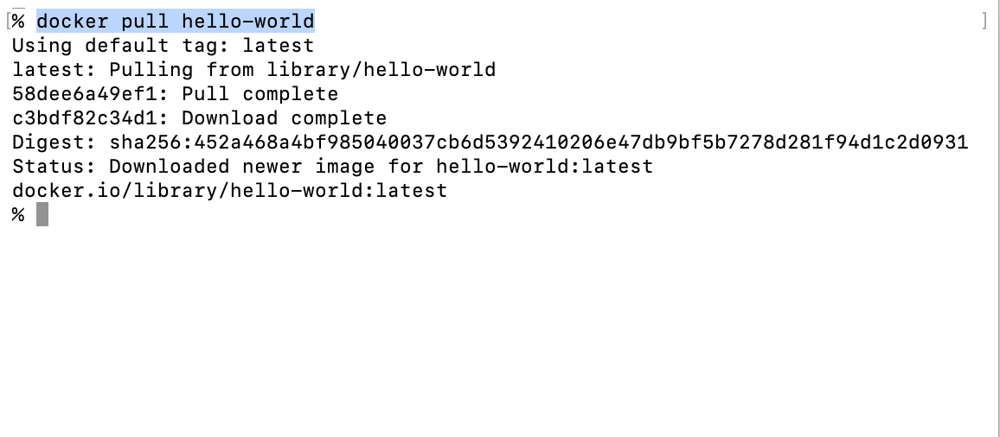


**建立新的Container** <br />
*Docker run 如果沒有東西就會自己pull，再run* <br />
*Flow:從本地找有無image，沒有的話就去Docker Hub(倉庫)找，pull下來再run*
```
docker container run <imageName> or docker run <imageName>
```
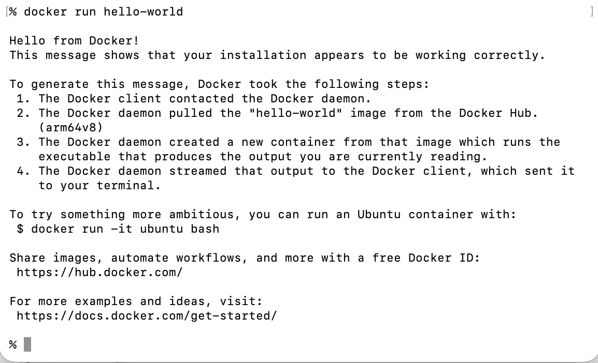


**命名自己的Container**
```
docker run --name <containerName> <image>:<tag>
```
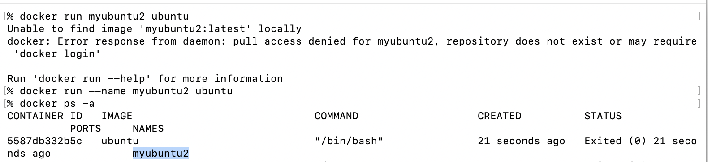


**Docker help:想知道更多指令有啥怎麼用，直接輸入docker**
```
docker
``` 
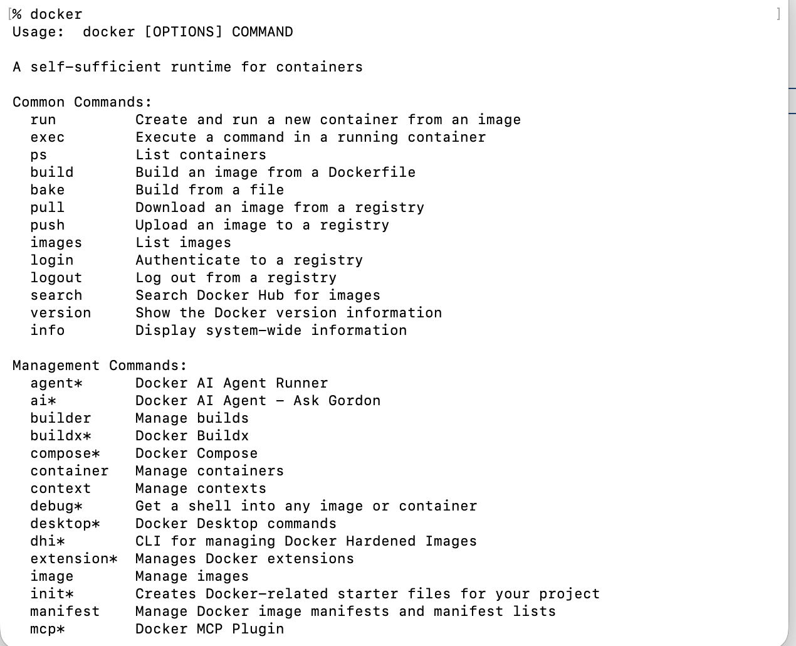


**查看現在的Docker版本**
```
docker -v or docker --version
```
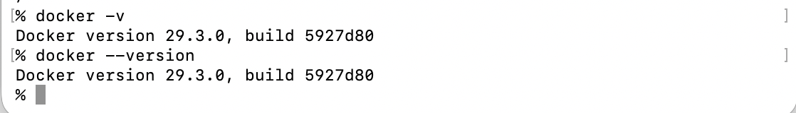


**查看Docker狀態，ps=process status(無論有無運行)**
```
docker ps
```
````
docker ps --all
````
`````
docker ps -a
``````
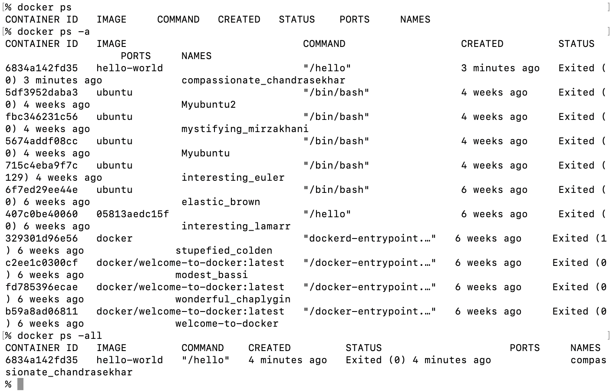


**開啟或停用或重啟Docker cotanier**
```
docker start/stop/restart <cotainerID> or <containerName>
```
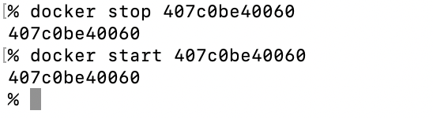


**刪除container(需要先手動stop container)，加-f就是強制刪除正在運行的容器**
```
docker rm <containerID> or <containerName>
```
````
docker rm -f <containerID> or <containerName>
````
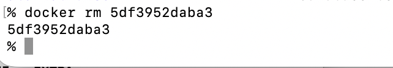
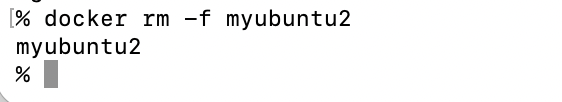


**查看目前系統有的images**
```
docker images
```
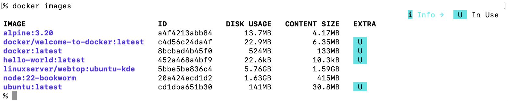

**刪除image**
```
docker rmi <imageName>
```
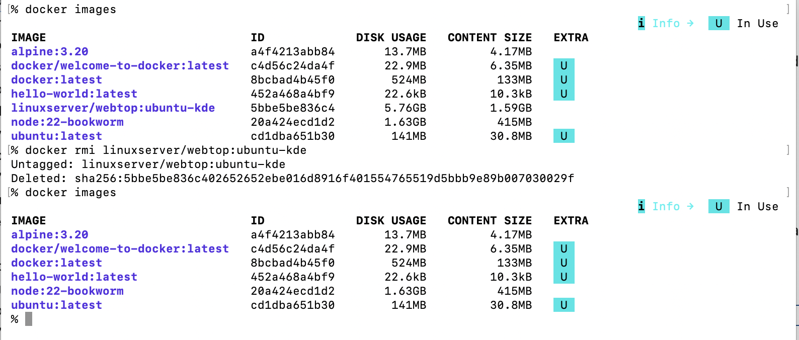