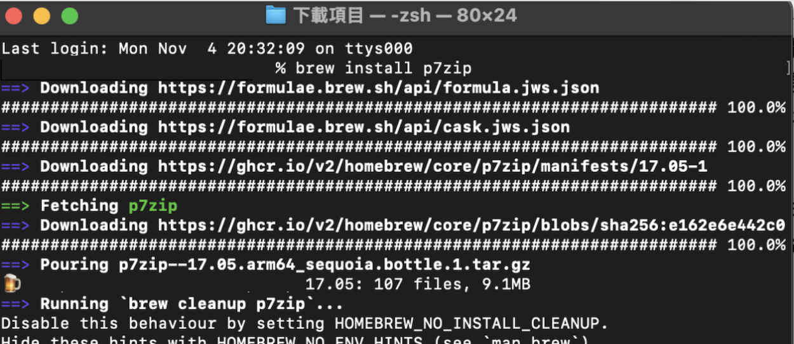
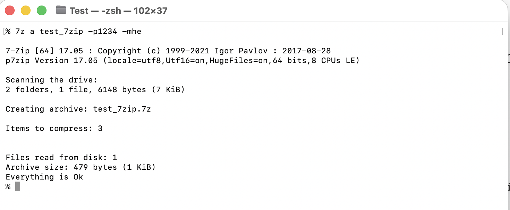

7-Zip是開放原始碼的資料壓縮程式
主要在Microsoft Windows作業系統運作

而p7zip是POSIX([可移植系統介面Portable Operating System Interface](https://zh.wikipedia.org/zh-tw/可移植操作系统接口))/Unix-like([類Unix系統](https://zh.wikipedia.org/zh-tw/类Unix系统))系統的7-Zip軟體

以下會透過Homebrew安裝p7zip
以及加解壓縮（加解密）的指令

1.使用Homebrew安裝p7zip
打開Terminal
輸入 **brew install p7zip**

2.加解密 
cd 到要解壓縮的目錄
輸入**7z a 輸出檔名 -p**
∆ 7z → 啟動7zip程式
∆ a → Add
∆ -p → Password
∆ -mhe=on (隱藏壓縮檔內部的檔名清單)→ Method:Header Encryption = on ☢︎only 7z supported
∆ 

