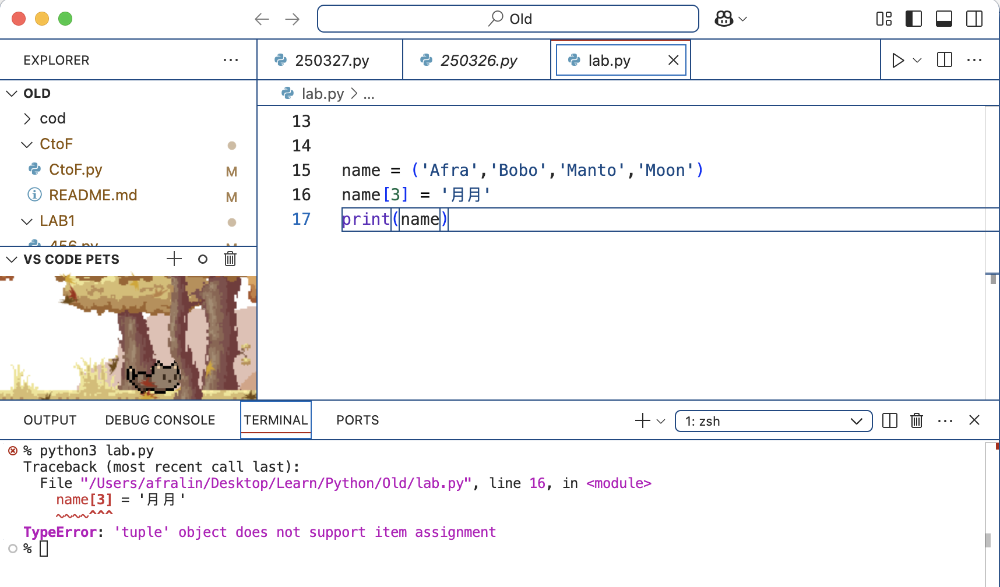
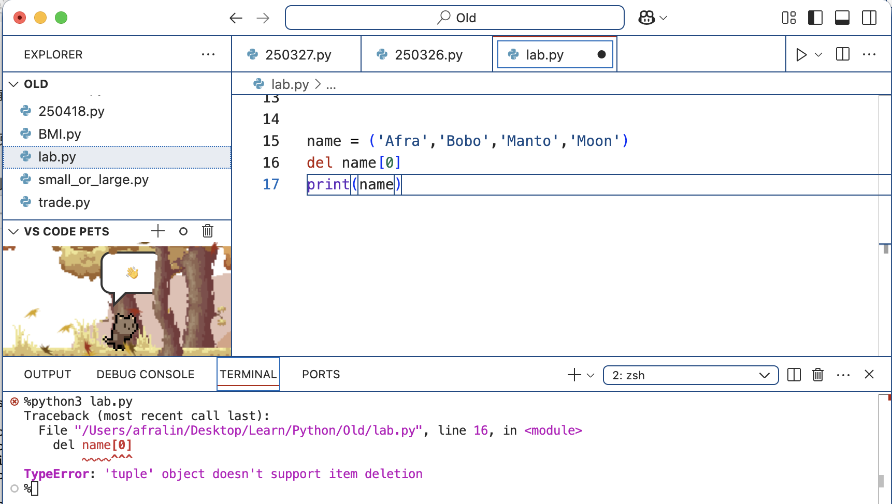
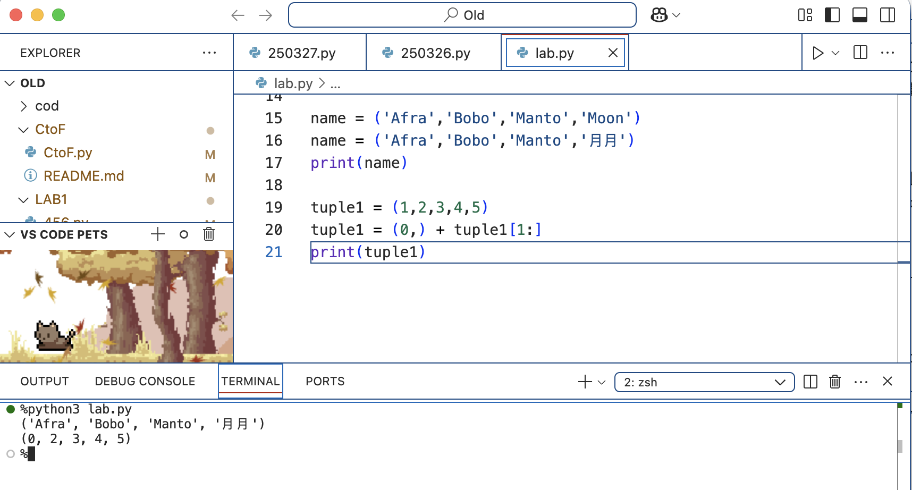

> 涵蓋概念：int、float、bool、str（操作/格式化）、list、tuple

---

## 1. 整數 int

```python
year = int('2026')   # 字串轉整數
print(year)          # 2026
print(type(year))    # <class 'int'>
```


---

## 2. 浮點數 float

除法運算結果一律是 float，即使整除也一樣：

```python
a = 5
b = 3
c = a / b
print(c)          # 1.6666666666666667
print(type(c))    # <class 'float'>
```


---

## 3. 布林值 bool

```python
a = 10 > 1
print(a)          # True
print(type(a))    # <class 'bool'>
```

:::note
`True` / `False` 開頭必須大寫，全小寫會報錯。
:::


---

## 4. 字串 str

字串可用單引號或雙引號表示，Python 支援 Unicode（含中文、emoji）：

```python
text1 = 'Hello World~您好！'
text2 = "Hello World 2 🌏"
```

### 字串運算

```python
# 加法：串接
greeting = 'Hi'
greeting2 = 'Yo'
print(greeting + ',' + greeting2 + '!')   # Hi,Yo!

# 乘法：重複
text = 'Ya'
print(text * 5)   # YaYaYaYaYa
```

### 索引與切片

```python
text = 'Hello World'
print(text[0])      # H（第一個字元）
print(text[-1])     # d（最後一個字元）
print(text[6:8])    # Wo
print(text[8:])     # rld
```

### 常用方法

```python
text = '   Welcome to this web site   '
print(text.strip())          # 去除兩端空白

text = 'Hello World'
print(text.upper())          # HELLO WORLD
print(text.lower())          # hello world

text = 'Welcome to this web site'
words = text.split()         # ['Welcome', 'to', 'this', 'web', 'site']

# join：list 合併成字串
words = ['Welcome', 'to', 'this', 'web', 'site']
print(''.join(words))        # Welcometothiswebsite
print(' '.join(words))       # Welcome to this web site
```


### 字串格式化

```python
stuff = 'pen'
price = 5

# 舊式（% 格式）
print('This is your %s and it is %d dollars.' % (stuff, price))

# .format()
print('This is your {} and it is {} dollars.'.format(stuff, price))

# f-string（推薦）
print(f'This is your {stuff} and it is {price} dollars.')
```

:::tip
f-string 最簡潔，也支援直接放運算式：`f'{price * 2}'`
:::


### 字串不可直接修改

字串是不可變的（immutable），要「修改」只能建立新字串：

```python
text = 'Hey you'
text = text[:7] + '! yeah you'
print(text)   # Hey you! yeah you
```

### 字串轉數字

```python
text = '85839305'
number = int(text)
print(type(number), number)   # <class 'int'> 85839305
```


---

## 5. 串列 list

用方括號 `[]` 儲存有序元素，可包含不同型別，**可修改**：

```python
list1 = [1, 2, 3, 4, 5]
list2 = ['banana', 'apple', 'papaya']
list3 = [1, 'pen', True]
list4 = ['pen', 'price', 5, ['your', 'stuff']]
```

### 索引與修改

```python
print(list3[0], list4[2])    # 1 5
print(list4[-1])             # ['your', 'stuff']

list2[2] = 'pig'             # 修改元素
list2.append('papaya')       # 末端新增
del list2[2]                 # 刪除指定位置
print(len(list2))            # 元素個數

if 5 in list2:
    print('5 is in the list2')
else:
    print('5 is not in the list2')
```


---

## 6. 元組 tuple

用小括號 `()` 儲存有序元素，**不可修改值**，只能重新賦值：

```python
tuple1 = (4, 5, 6, 7, 8)
```

:::caution
Tuple 只有一個元素時，必須加逗號，否則會被解析為括號運算：

```python
tuple2 = (1)    # type: int（不是 tuple！）
tuple3 = (1,)   # type: tuple（正確）
```
:::


### 切片操作

```python
tuple1 = (0, 1, 2, 3, 4, 5)

print(tuple1[::-1])    # (5, 4, 3, 2, 1, 0)  反轉
print(tuple1[1::2])    # (1, 3, 5)            奇數索引元素
print(tuple1[::2])     # (0, 2, 4)            偶數索引元素
print(tuple1[-5:])     # (1, 2, 3, 4, 5)      最後 5 個
print(tuple1[:-5])     # (0,)                  除了最後 5 個
```


### 不可修改 vs 重新賦值

```python
# 直接修改會報錯
name = ('Afra', 'Bobo', 'Manto', 'Moon')
name[3] = '月月'   # TypeError




# 重新賦值可以
name = ('Afra', 'Bobo', 'Manto', '月月')   # OK

# 利用切片拼接
tuple1 = (1, 2, 3, 4, 5)
tuple1 = (0,) + tuple1[1:]
print(tuple1)   # (0, 2, 3, 4, 5)
```



---

:::note
集合（Set）與字典（Dict）的筆記在 Claude 教學 L5、L4 單元。
:::
