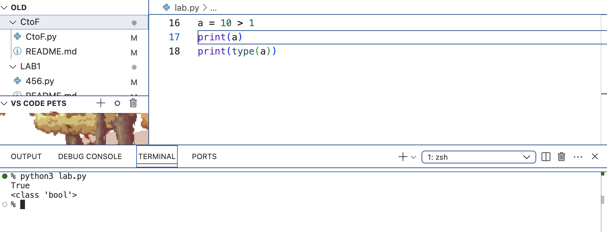

### 1.整數 integer | int
```
year = int('2026')  #將2026這個字串轉換成整數2026，並賦予給year變數
print(year)         #輸出 year
print(type(year))   #輸出型別 <class 'int'>
```

### 2.浮點數（小數）float
````
a = 10 > 1          #10>1，並賦予給a變數
print(a)            #輸出 a ，10是大於1嗎？對。所以輸出true
print(type(a))      #輸出型別<class 'bool'>
````

### 3.布林值 boolean | bool (Ture False)
`````
`````
### 4.字串 string | str
``````
``````
### 5.串列 list
``````
``````
### 6.元組 tuple
```````
```````
### 7.字典 dict
`````````
`````````
