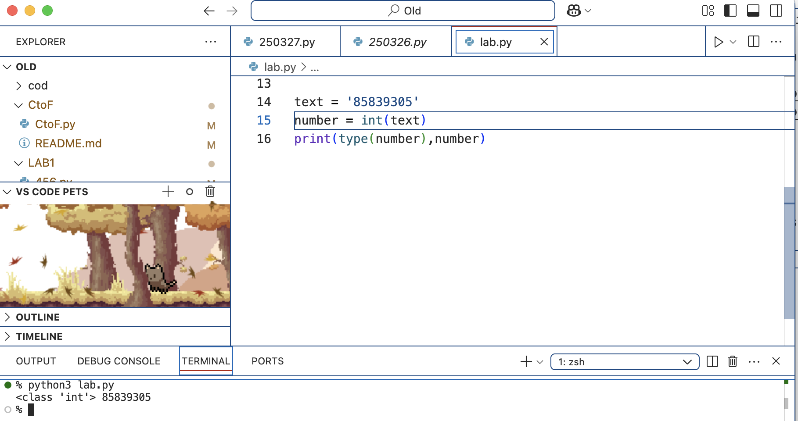
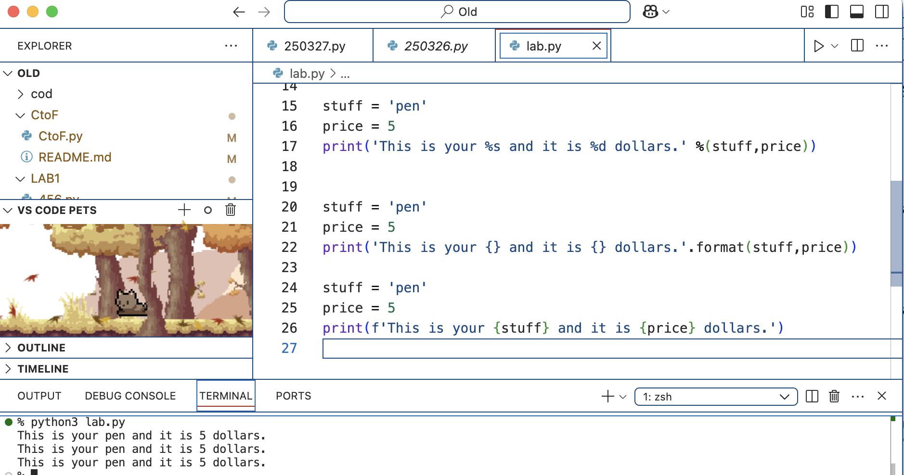
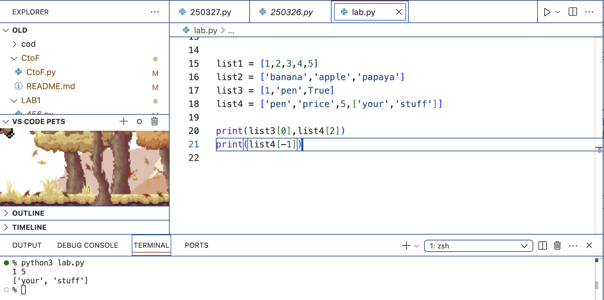
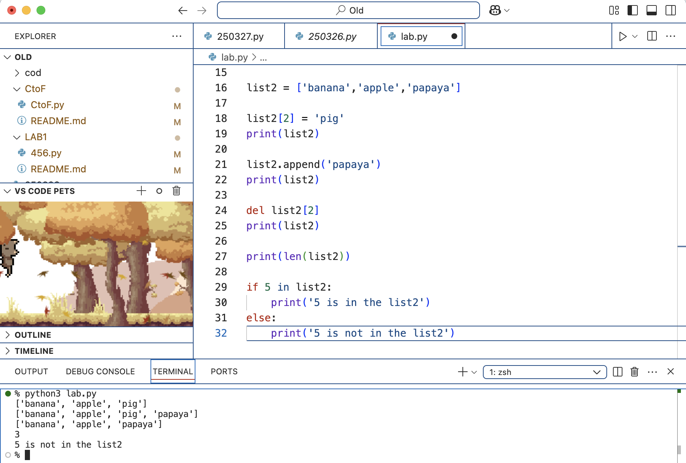
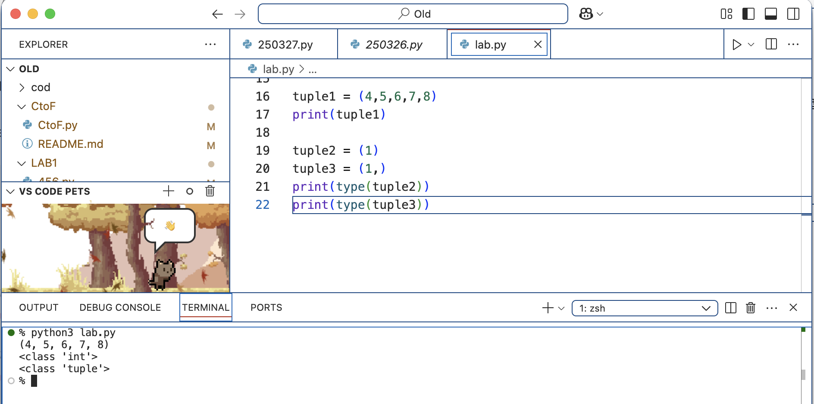
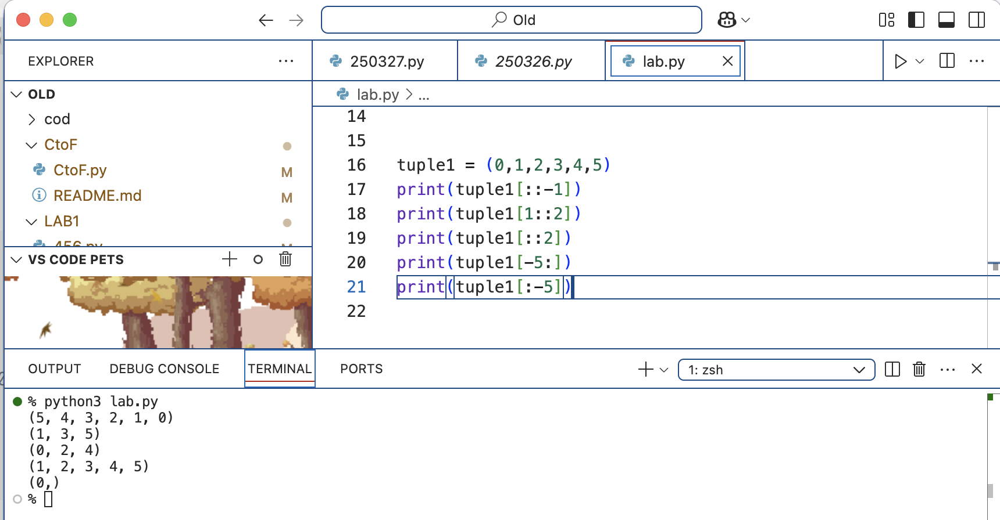

### 1.整數 integer | int
```
year = int('2026')  #將2026這個字串轉換成整數2026，並賦予給year變數
print(year)         #輸出 year
print(type(year))   #輸出型別 <class 'int'>
```

### 2.浮點數（小數）float
````
a = 5              #a等於5
b = 3              #b等於3
c = 5 / 3          #c等於5除以3
print(c)           #輸出5除以3
print(type(c))     #輸出型別<class 'float'>
````

### 3.布林值 boolean | bool (Ture False)
Ture False開頭必須大寫
`````
a = 10 > 1          #10>1，並賦予給a變數
print(a)            #輸出 a ，10是大於1嗎？對。所以輸出True
print(type(a))      #輸出型別<class 'bool'>
`````

### 4.字串 string | str
``````
可用單引號或是雙引號表示，且Python是Unicode字符所以支持任何Unicode字符(🌏)
text1 = 'Hello World~您好！'
text2 = "Hello World 2 🌏 "

print(text1)                 #輸出Hello World~您好！
print(text2)                 #輸出Hello World 2 🌏

可用加法或是乘法運算符
✎加法，組合字串
greeting = 'Hi'
greeting2 = 'Yo'
sentence = greeting + ',' + greeting2 + '!'
print(sentence)              #輸出Hi,Yo!

✎乘法，重複字串
text3 = 'Ya'
text4 = text3 * 5
print(text4)

可索引跟切片
text5 = 'Hello World'

print(text5[0])         #輸出 H
print(text5[-1])        #輸出 d
print(text5[6:8])       #輸出 Wo
print(text5[8:])        #輸出 rld
``````


```````
Python字串是不可以改變的，但可以使用切分或是連接的方式創立新的字串
text6 = 'Hey you'
text6 = text6[:7] + '! yeah you'
print(text6)            #輸出 Hey you! yeah you

轉換大小寫
Name = 'Afra'
print(Name.upper())     #輸出 AFRA
print(Name.lower())     #輸出 afra

移除空格
text = '   Welcome to this web site   '
print(text)             #會把空格輸出
print(text.strip())     #輸出去掉空格的

分割字串
text = 'Welcome to this web site'
words = text.split()
print(words)             #輸出 ['Welcome', 'to', 'this', 'web', 'site']

合併字串
words = ['Welcome', 'to', 'this', 'web', 'site']
text = ''.join(words)    #''沒有打空格
print(text)              #輸出 Welcometothiswebsite

words = ['Welcome', 'to', 'this', 'web', 'site']
text = ' '.join(words)   #' '有打空格
print(text)              #輸出 Welcome to this web site
```````


````````
轉換成數字
text = '85839305'
number = int(text)
print(type(number),number)      #輸出 <class 'int'> 85839305
````````

`````````
百分比格式化(舊式但常見)
%s：插入字串 %d：插入整數 %f：插入浮點數
stuff = 'pen'
price = 5
print('This is your %s and it is %d dollars.' %(stuff,price))

.format()格式化
字串裡的{}是預留空位，.format()會照順序把變數值放進去
stuff = 'pen'
price = 5
print('This is your {} and it is {} dollars.'.format(stuff,price))

f-strings格式化（最新最方便推薦的方式）
利用{}插入變數或是運算式
stuff = 'pen'
price = 5
print(f'This is your {stuff} and it is {price} dollars.')
`````````


### 5.串列 list
以中(方)括號 [] 儲存不同類型的物件（整數、字串等.....）<br />
每一筆資料稱為元素(element)，每一個元素的位置稱為索引值(index)，從0開始
list是組有序元素 <br />
可變更(所以這裡的元素可以視為變數)
``````````
list1 = [1,2,3,4,5]                          #元素皆為整數
list2 = ['banana','apple','papaya']          #元素皆為字串
list3 = [1,'pen',True]                       #list可包含不同的資料型別
list4 = ['pen','price',5,['your','stuff']]   

索引，從0開始，可負數會用相反的方向去索引
print(list3[0],list4[2])                     #輸出 1 5
print(list4[-1])                             #輸出 ['your', 'stuff']

將list2的第二個元素改成pig
list2[2] = 'pig'
print(list2)

將list2末端添加一個新元素papaya
list2.append('papaya')
print(list2)

刪除list2的第二個元素
del list2[2]
print(list2)

取list2中元素的個數
print(len(list2))

檢查list2裡面是否包含某個元素
if 5 in list2:
    print('5 is in the list2')
else:
    print('5 is not in the list2')
``````````


### 6.元組 tuple
以小括號()儲存元素儲存不同類型的物件（整數、字串等.....）<br />
每一筆資料稱為元素(element)，每一個元素的位置稱為索引值(index)，從0開始
Tuple是組有序元素 <br />
**不可**變更值，只能重新賦值
```````````
tuple1 = (4,5,6,7,8)
print(tuple1)

Tuple如果只有一個元素，要記得加逗號
tuple2 = (1)                    #沒有輸入逗號
tuple3 = (1,)                   #有輸入逗號
print(type(tuple2))             #輸出 <class 'int'>   因為數學運算也會用到()，所以會被解析被括弧包起來的整數
print(type(tuple3))             #輸出 <class 'tuple'>

t = ('banana')                  #沒有輸入逗號
for char in t:             
    print(char,type(t))         #輸出 b a n a n a <class 'str'>

t = ('apple',)                  #有輸入逗號
for char in t:
    print(char,type(t))         #輸出 apple <class 'tuple'>
```````````

```
tuple1 = (0,1,2,3,4,5)

反轉Tuple
print(tuple1[::-1])             #輸出 (5,4,3,2,1,0)
                                Slicing:[start:stop:step]
                                起始結尾空白沒有限制，反方向第一步開始算
取得奇數索引的元素
print(tuple1[1::2])             #輸出 (1,3,5)
                                Slicing:[start:stop:step]
                                起始從[1]開始，結尾空白沒有限制，步數兩步
                                所以[1]剛好在tuple1是數字1，數字1開始（含1）算兩步直到這個tuple結束，都要輸出
取得偶數索引的元素
print(tuple1[::2])              #輸出 (0,2,4)
                                Slicing:[start:stop:step]
                                起始結尾空白沒有限制，步數兩步
                                所以最開始是[0]，剛好在tuple1是數字0開始（含0）算兩步直到這個tuple結束，都要輸出

取得最後5個元素
print(tuple1[-5:])              #輸出 (1,2,3,4,5)
                                Slicing:[start:stop:step]
                                先反方向數5，走到數字1，沒有結束位置
                                所以到數字5是最後都要輸出
取得除了最後5個以外的所有元素
print(tuple1[:-5])              #輸出 (0,)
                                Slicing:[start:stop:step]
                                結束位置一樣反方向數到5，剛好是數字1，
                                Slicing規則是包含起點但不包含終點，
                                所以只剩下數字0
```

````

````
### 7.集合 set

### 8.字典 dict
