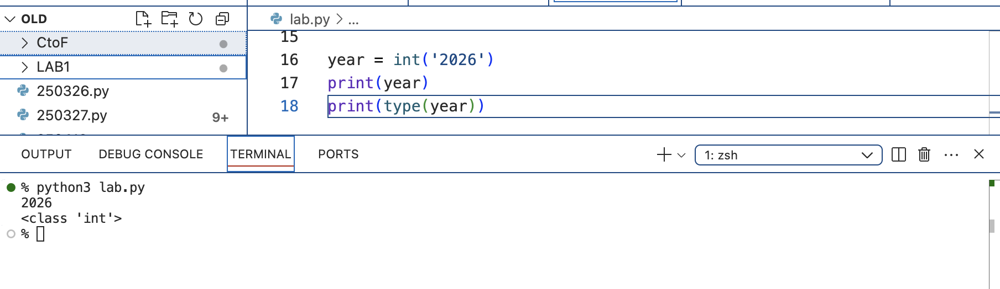
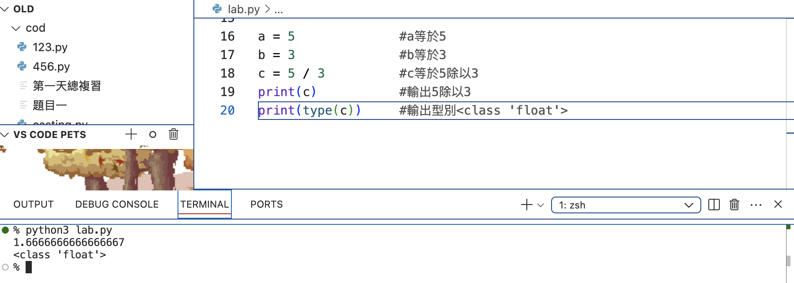
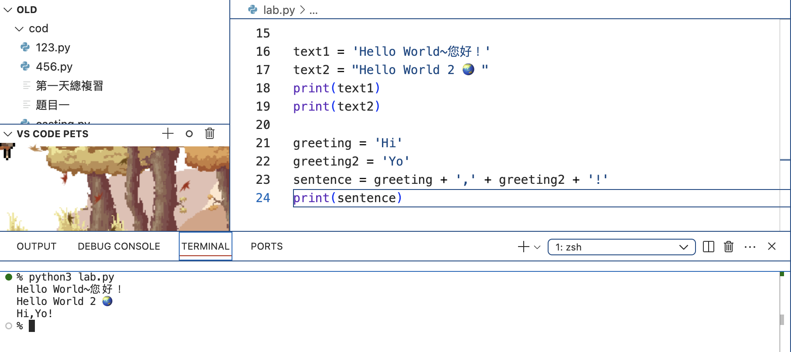
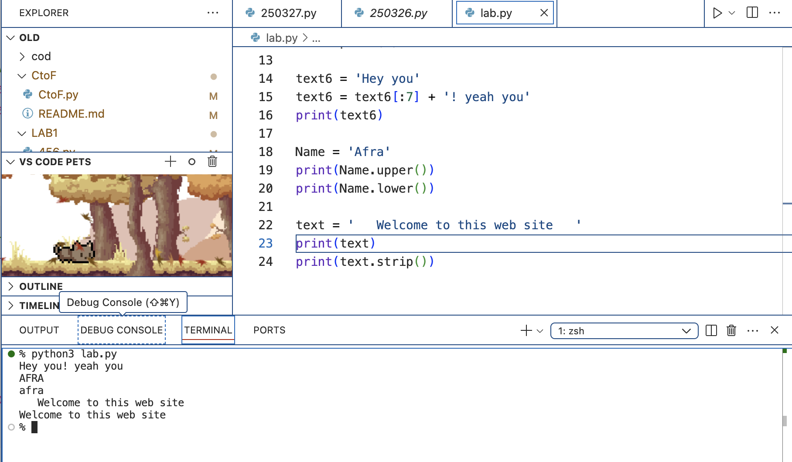
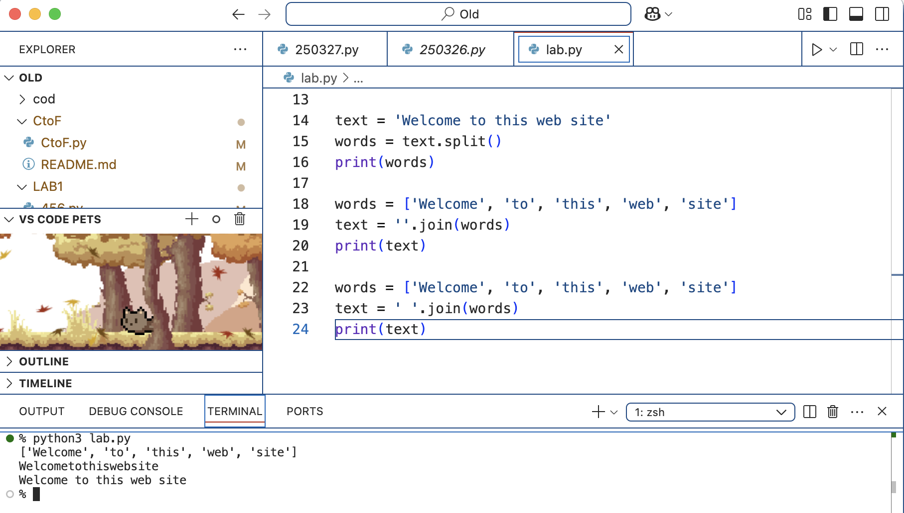

### 1.整數 integer | int
```
year = int('2026')  #將2026這個字串轉換成整數2026，並賦予給year變數
print(year)         #輸出 year
print(type(year))   #輸出型別 <class 'int'>
```

### 2.浮點數（小數）float
````
a = 5              #a等於5
b = 3              #b等於3
c = 5 / 3          #c等於5除以3
print(c)           #輸出5除以3
print(type(c))     #輸出型別<class 'float'>
````

### 3.布林值 boolean | bool (Ture False)
`````
a = 10 > 1          #10>1，並賦予給a變數
print(a)            #輸出 a ，10是大於1嗎？對。所以輸出true
print(type(a))      #輸出型別<class 'bool'>
`````

### 4.字串 string | str
``````
可用單引號或是雙引號表示，且Python是Unicode字符所以支持任何Unicode字符(🌏)
text1 = 'Hello World~您好！'
text2 = "Hello World 2 🌏 "

print(text1)                 #輸出Hello World~您好！
print(text2)                 #輸出Hello World 2 🌏

可用加法或是乘法運算符
✎加法，組合字串
greeting = 'Hi'
greeting2 = 'Yo'
sentence = greeting + ',' + greeting2 + '!'
print(sentence)              #輸出Hi,Yo!

✎乘法，重複字串
text3 = 'Ya'
text4 = text3 * 5
print(text4)

可索引跟切分
text5 = 'Hello World'

print(text5[0])         #輸出 H
print(text5[-1])        #輸出 d
print(text5[6:8])       #輸出 Wo
print(text5[8:])        #輸出 rld

Python字串是不可以改變的，但可以使用切分或是連接的方式創立新的字串
text6 = 'Hey you'
text6 = text6[:7] + '! yeah you'
print(text6)            #輸出 Hey you! yeah you

轉換大小寫
Name = 'Afra'
print(Name.upper())     #輸出 AFRA
print(Name.lower())     #輸出 afra

移除空格
text = '   Welcome to this web site   '
print(text)             #會把空格輸出
print(text.strip())     #輸出去掉空格的

分割字串
text = 'Welcome to this web site'
words = text.split()
print(words)           #輸出 ['Welcome', 'to', 'this', 'web', 'site']

合併字串
words = ['Welcome', 'to', 'this', 'web', 'site']
text = ''.join(words)    #''沒有打空格
print(text)              #輸出 Welcometothiswebsite

words = ['Welcome', 'to', 'this', 'web', 'site']
text = ' '.join(words)   #' '有打空格
print(text)              #輸出 Welcome to this web site

轉換成數字
text = '85839305'
number = int(text)
print(type(number),number)      #輸出 <class 'int'> 85839305


``````



### 5.串列 list
``````
``````
### 6.元組 tuple
```````
```````
### 7.字典 dict
`````````
`````````