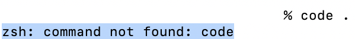
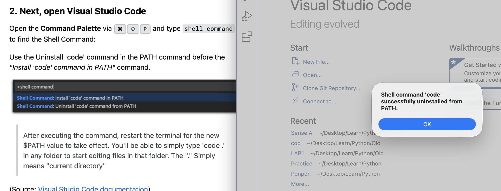
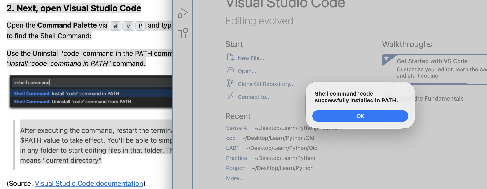

問題發生： 
Terminal輸入``con .``會跳出 
``-bash:code:command not found``

1.確認vscode有安裝且是在應用程式的folder

2.打開vscode，快捷鍵``⌘`` ``⇧`` ``P``，然後輸入shell找到shell相關的命令 
``Shell Command:Install 'code' command in PATH``  
``Shell Command:Uninstall 'code' command in PATH``  
先Uninstall，再Install 
Uninstall  
  
Install  

