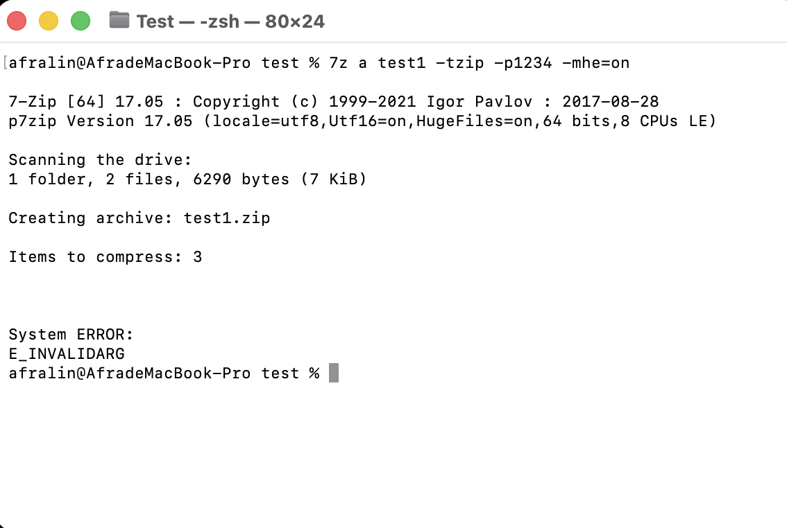
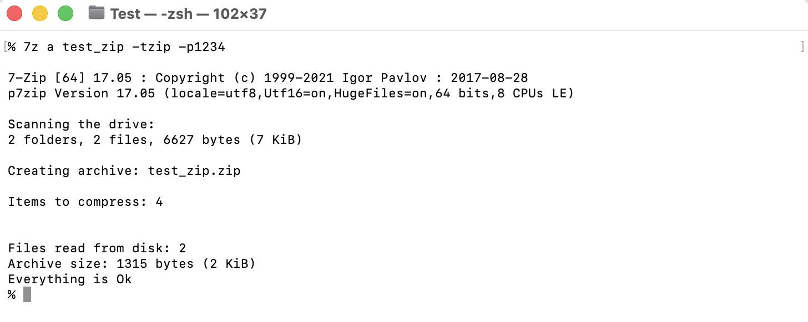
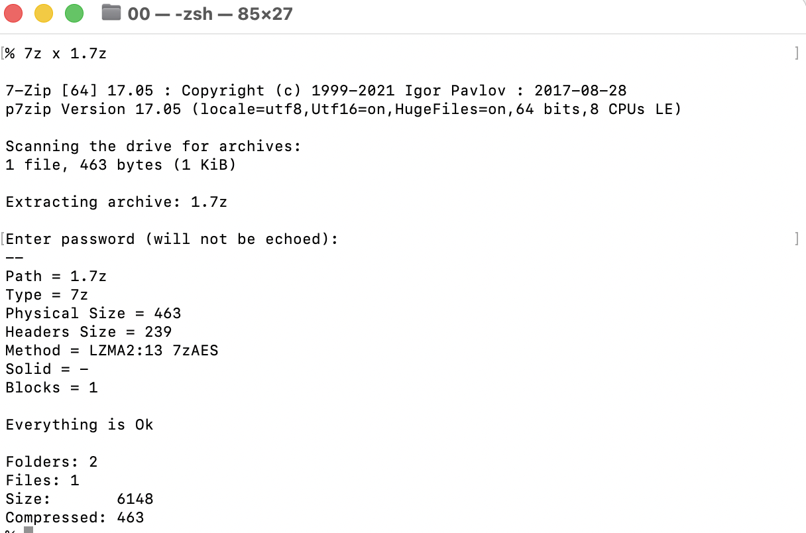
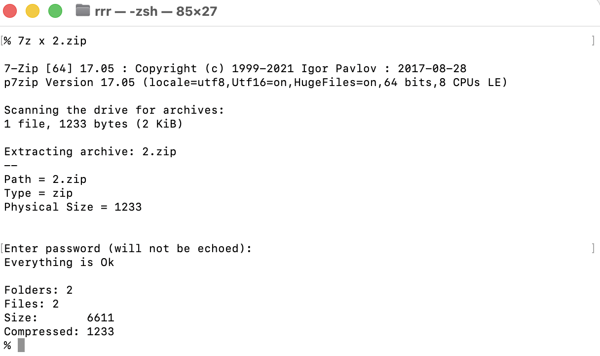

###
7-Zip是開放原始碼的資料壓縮程式，主要在Microsoft Windows作業系統運作

而p7zip是POSIX([可移植系統介面Portable Operating System Interface](https://zh.wikipedia.org/zh-tw/可移植操作系统接口))/Unix-like([類Unix系統](https://zh.wikipedia.org/zh-tw/类Unix系统))系統的7-Zip軟體

以下會透過Homebrew安裝p7zip
以及加解壓縮（加解密）的指令


1.使用Homebrew安裝p7zip
打開Terminal
輸入 **brew install p7zip**


```
brew install p7zip
```

2.加密及製作壓縮檔 <br />
cd 到要解壓縮的目錄 <br />
輸入**7z a my_file -p** <br />
∆ 7z → 啟動7zip程式 <br />
∆ a → Add <br />
∆ -p → Password <br />
∆ -mhe=on (隱藏壓縮檔內部的檔名清單)→ Method:Header Encryption = on 
☢︎zip不支援隱藏檔名<br />

<br />

```
7z a my_file -p** -mhe
```

zip不支援隱藏檔名範例，若輸入了-mhz則會報錯 <br />
<br />
拉掉-mhz後 <br />
<br />

```
7z a my_file -tzip -p**
```

3.解密壓縮檔

