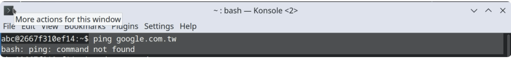
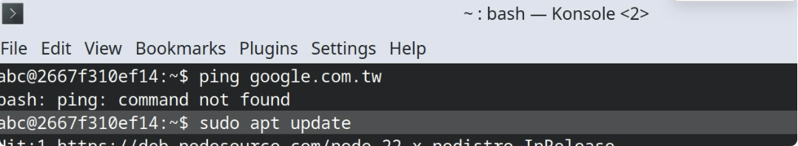
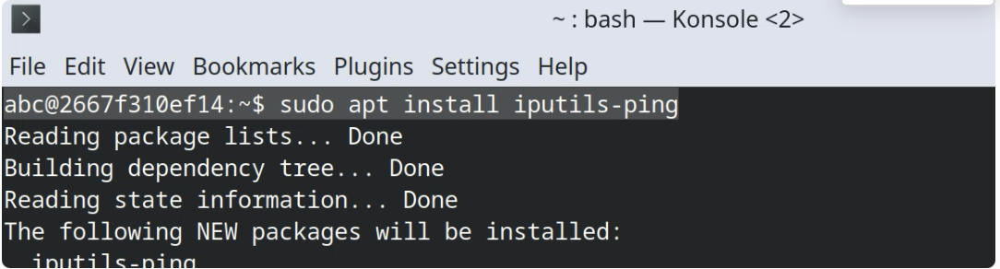
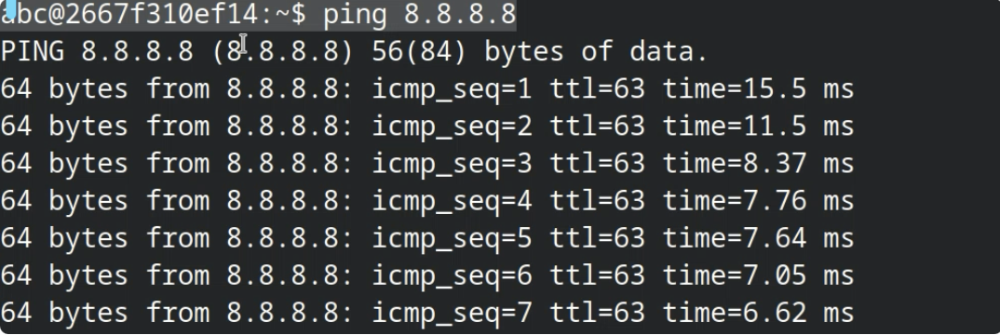

問題發生：<br />
``bash:ping：command not found``


1.輸入``sudo apt update``先更新apt
```
sudo apt update
```



2.輸入``sudo apt install iputils-ping``用apt安裝ping
```
sudo apt install iputils-ping
```


3.裝完就可以使用ping了
